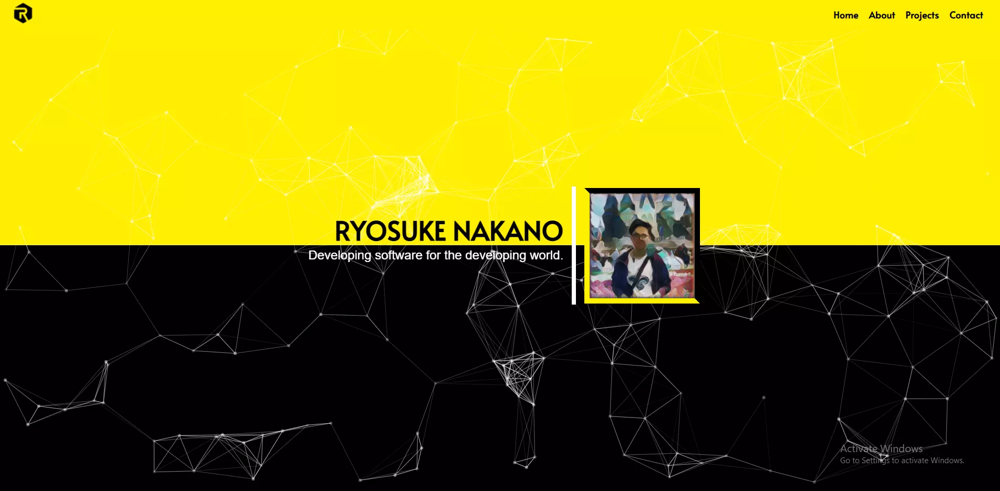

  

# 
 **ryonakano.com - 2.0** 

    A visual update to my personal portfolio.

    A fully frontend web app built with HTML/CSS and Javascript, utilizing the ReactJS Framework.

 

## Color Profile

| Color         | Hex           | 
|:-------------:|:-------------:| 
| Canary Yellow | `#ffef00`     |
| Black         | `#000000`     |
| White         | `#ffffff`     |  